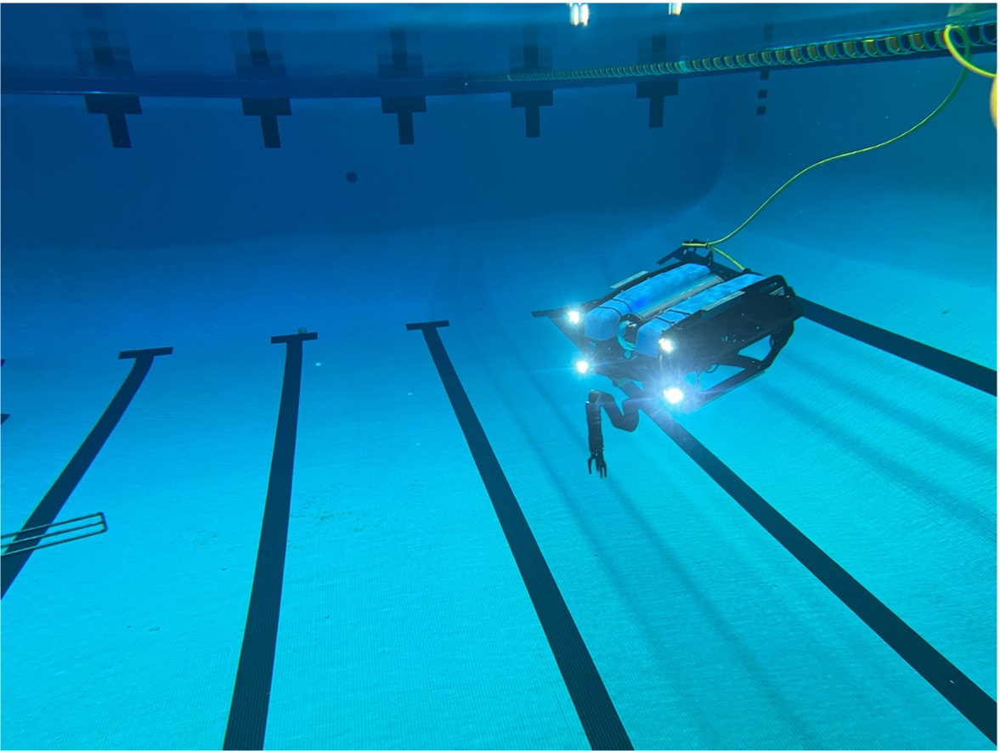

## Floating-Base Manipulator Dynamics For Underwater Robots

A toolkit for differentiable modeling of fixed- or floating-base serial manipulators.
The library ingests URDF chains and produces symbolic kinematics, dynamics, energy terms,
and identification regressors as CasADi graphs suitable for optimization, estimation,
and control.

<p align="center">
  
  
</p>

<p align="center">
  <br/>
  Sim to real comparison, left open loop prediction, right real system.
</p>

The core implementation constructs kinematic transforms, Jacobians, and Lagrangian terms
directly from URDF descriptions. All major quantities are represented as CasADi
expressions, enabling analytic derivatives and optional JIT compilation.

Low-level rigid-body and underwater vehicle dynamics utilities are provided by the
`diff_uv` library, which is included as a Git submodule. This separation keeps vehicle
and manipulator modeling modular while allowing tight symbolic integration.

The model supports payload effects, friction, and, for underwater applications,
hydrodynamic terms.

```
Floating-KinDyn-Graph/
├── baseVehicle/        # floating-base dynamics submodule (vehicle and hydrodynamics utilities) 
├── system/             # manipulator and coupling dynamics
└── usage/              # examples, notebooks, datasets
```

## Capabilities and implementation status

* [x] Forward kinematics, Euler and quaternion forms.
* [x] Jacobians, geometric, body, and analytic, base-augmented for floating base.
* [x] Forward dynamics with friction and payload terms.
* [x] Inverse dynamics, Lagrange–Euler formulation.
* [x] Energy and Lagrangian terms.
* [x] System identification regressors, Bayesian estimator, fast convex estimator.
* [x] Inverse kinematics, closed-form.
* [x] Workspace analysis via sampling (`RobotDynamics.approximate_workspace`).
* [x] EKF helpers and controller utilities.
* [x] CasADi code generation for C, C++, and MATLAB.
* [x] Optional CasADi JIT support.

## Installation

Clone the repository **with submodules**:

```bash
git clone --recurse-submodules https://github.com/edxmorgan/Floating-KinDyn-Graph.git
cd Floating-KinDyn-Graph
```

If you already cloned without submodules:

```bash
git submodule update --init --recursive
```

<!-- Create and activate a virtual environment:

```bash
python3 -m venv .venv
source .venv/bin/activate
python -m pip install --upgrade pip
```

Install Python dependencies:

```bash
pip install casadi numpy scipy matplotlib urdf-parser-py transforms3d
``` -->

## Core usage

```python
import casadi as ca
import numpy as np
import system.robot as robotSystem
import os

robot = robotSystem.RobotDynamics(use_jit=True)

project_root = os.path.abspath(os.path.join(os.getcwd(), '..'))
path_to_urdf = os.path.join(
    project_root,
    'usage',
    'urdf',
    'reach_alpha_5',
    'alpha_5_robot.urdf'
)

robot.from_file(path_to_urdf)

root = "base_link"
tip = "alpha_standard_jaws_base_link"

robot.build_model(
    root,
    tip,
    floating_base=True,
    has_endeffector=False
)

M = robot.get_inertia_matrix()
C = robot.get_coriolis_centrifugal_matrix()
G = robot.get_gravity_vector()
qdd = robot.get_forward_dynamics()
```

## System identification

The estimator is implemented in `system/system_id.py` (`SerialLinksDynamicEstimator`)
and solves a fast constrained convex fit via CVXPY (MOSEK by default).

<p align="center">
  <br/>
  Sim to real comparison, left open loop prediction, right real system.
</p>

Example workflows:

* `usage/dynamic_parameter_identification.ipynb`
* `usage/alpha_mcmc.ipynb`

Cached outputs, if generated, are stored under:

* `usage/alpha_mcmc_results_*.npz`
* `usage/posterior_alpha.bin`

### Data requirements

Identification expects CSV logs containing per-joint positions, velocities,
accelerations, and torques. Example datasets are provided under `usage/data/`.

## Controllers and observers

`system/controllers.py` provides `RobotControllers.build_arm_pid()` with feedforward
gravity compensation. Example usage is shown in `usage/controllers.ipynb`.

EKF examples are provided in `usage/joint_ekf.ipynb`.

## Workspace analysis

`RobotDynamics.approximate_workspace` samples joint limits and returns both an axis-aligned
bounding box and a point cloud.

Reference limits for the Alpha manipulator are defined in `usage/alpha_reach.py`. A
precomputed workspace sample is stored in `usage/workspace.npy`.

## References

* Roy Featherstone, *Robot Dynamics Algorithms*, Kluwer, 1987.
* M. W. Spong, S. Hutchinson, M. Vidyasagar, *Robot Modeling and Control*, Wiley, 2006.
* Bruno Siciliano et al., *Robotics: Modelling, Planning and Control*, Springer, 2010.

## Caution

This toolkit is experimental and validated on a limited set of manipulators. Review all
generated models before deploying in safety-critical control loops.