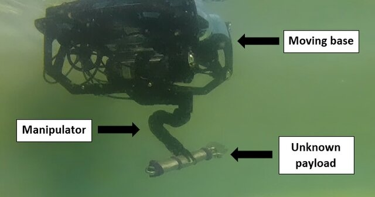

# Manipulator Dynamics
A research-oriented toolkit for differentiable modeling of fixed- or floating-base
serial manipulators. The library ingests URDF chains and produces symbolic kinematics,
dynamics, energy terms, and identification regressors as CasADi graphs suitable for
optimization, estimation, and control.



## Overview
The core implementation constructs kinematic transforms, Jacobians, and Lagrangian
terms directly from URDF descriptions. All major quantities are represented as CasADi
expressions, enabling analytic derivatives and optional JIT compilation. The model
supports payload effects, friction, and (for underwater applications) buoyancy and
center-of-buoyancy terms.

## Capabilities and implementation status
- [x] Forward kinematics (Euler and quaternion forms).
- [x] Jacobians (geometric, body, and analytic; base-augmented for floating base).
- [x] Forward dynamics with friction and payload terms.
- [x] Inverse dynamics (Lagrange-Euler).
- [x] Energy and Lagrangian terms.
- [x] System identification regressors and CVXPY estimator.
- [x] Inverse kinematics (closed-form arm IK in `usage/alpha_reach.py`).
- [x] Workspace analysis via sampling (`RobotDynamics.approximate_workspace`).
- [x] EKF helpers and controller utilities.
- [x] CasADi code generation for C/C++/MATLAB.
- [x] Optional CasADi JIT support (Clang recommended).

## Installation

```bash
python3 -m venv .venv
source .venv/bin/activate
python -m pip install --upgrade pip
pip install casadi numpy scipy matplotlib urdf-parser-py transforms3d
```

CasADi JIT expects Clang on Linux/macOS (`CC=clang`). Adjust
`RobotDynamics.jit_func_opts` if a different compiler is required.

## Core usage

```python
import casadi as ca
import numpy as np
from system.robot import RobotDynamics

robot = RobotDynamics(use_jit=True)
robot.from_file("usage/urdf/reach_alpha_5/alpha_5_robot.urdf")
robot.build_model("base_link", "alpha_standard_jaws_base_link", floating_base=False)

M = robot.get_inertia_matrix()
C = robot.get_coriolis_centrifugal_matrix()
G = robot.get_gravity_vector()
qdd = robot.get_forward_dynamics()
```

## System identification
The estimator is implemented in `system/system_id.py` (`SerialLinksDynamicEstimator`)
and solves a constrained convex fit via CVXPY (MOSEK by default). Example workflows are
provided in:
- `usage/dynamic_parameter_identification.ipynb`
- `usage/alpha_mcmc.ipynb`

Cached outputs (if generated) are stored under `usage/alpha_mcmc_results_*.npz` and
`usage/posterior_alpha.bin`.

### Data requirements (manipulator log)
The identification notebook expects CSV logs with per-joint positions, velocities,
accelerations, and torques. Example datasets are under `usage/data/`.

## Controllers and observers
`system/controllers.py` provides `RobotControllers.build_arm_pid()` with feedforward
gravity compensation. Example usage is in `usage/controllers.ipynb`. EKF examples are
in `usage/joint_ekf.ipynb`.

## Workspace analysis
`RobotDynamics.approximate_workspace` samples joint limits and returns both an AABB
and a point cloud. Reference limits for the Alpha manipulator are defined in
`usage/alpha_reach.py`, and a precomputed sample cloud is stored in `usage/workspace.npy`.

## Generated artifacts
Several notebooks can export C code and shared libraries for embedded deployment.
These generated files are not tracked in the repository and should be produced locally.

## References
- Roy Featherstone. *Robot Dynamics Algorithms*. Kluwer, 1987.
- M. W. Spong, S. Hutchinson, M. Vidyasagar. *Robot Modeling and Control*. Wiley, 2006.
- Bruno Siciliano et al. *Robotics: Modelling, Planning and Control*. Springer, 2010.

## Caution
This toolkit is experimental and validated on a limited set of manipulators. Review
all generated models (especially friction and payload terms) before use in
safety-critical control loops.
